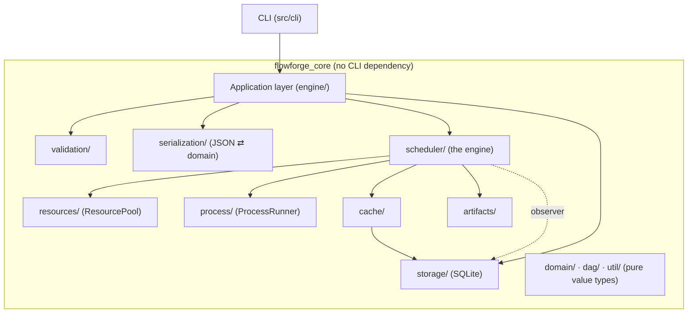

# FlowForge

**A small, local-first DAG pipeline orchestration engine — CLI-first, no GUI, no
cloud, no distributed workers.**

FlowForge runs a Directed Acyclic Graph of tasks described in JSON, where each
task is an external program (a Python script, a native executable, any binary).
It works out which tasks are ready, runs independent ones concurrently within
configurable concurrency and resource limits, and handles retries, timeouts,
cancellation, failure propagation and local result caching. Every run — its
tasks, attempts and captured logs — is persisted to SQLite.

> **Status: 0.1.0.** Builds cleanly from a fresh checkout; 140 tests pass
> (`ctest`), also under ASan/UBSan. Developed and tested on macOS (arm64);
> Linux is expected to work and is in CI. Windows is not supported yet.

```
$ flowforge run pipeline.json
Pipeline: ml_pipeline  (4 tasks)

[RUNNING ] prepare
[SUCCESS ] prepare  1.23s
[RUNNING ] features
[RUNNING ] statistics
[SUCCESS ] statistics  0.82s
[SUCCESS ] features  2.31s
[RUNNING ] train
[SUCCESS ] train  4.10s

Pipeline SUCCEEDED in 5.48s
  4 succeeded, 0 cached, 0 failed, 0 skipped, 0 cancelled  (of 4)
```

---

## Contents

- [Features](#features)
- [Why it is built this way](#why-it-is-built-this-way)
- [Architecture](#architecture)
- [Requirements](#requirements)
- [Build, test, run](#build-test-run)
- [Install](#install)
- [Writing a pipeline](#writing-a-pipeline)
- [CLI](#cli)
- [Concurrency & performance](#concurrency--performance)
- [Limitations](#limitations)
- [Roadmap](#roadmap)
- [Documentation](#documentation)
- [License](#license)

---

## Features

- **Explicit DAG** of tasks with cycle detection that reports the offending
  path (`a -> b -> c -> a`), not a generic failure.
- **Concurrent execution** of independent tasks up to `--max-concurrency`, with
  a replaceable scheduling policy (priority → readiness → id).
- **Resource-aware scheduling** — reserve/release coarse cpu / memory / gpu
  counts; `A(4 cores) + B(4)` run together on 8 cores, `C(4)` waits.
- **External-process tasks** — Python, native executables, anything. No shell:
  arguments reach `execve` verbatim.
- **Retries** with exponential backoff; every attempt is persisted. Config
  errors (missing interpreter, missing input) are never retried.
- **Timeouts** — SIGTERM then SIGKILL; no zombies.
- **Cancellation** — Ctrl-C, or `flowforge cancel <run-id>` from another shell.
- **Failure propagation** is branch-local: a failed branch skips its
  descendants; unrelated branches keep running.
- **Result cache** — an unchanged task becomes `CACHED`; a changed input
  re-executes. Only successful runs are cached; stale entries are never reused.
- **File artifacts** — data flows task → file → task; FlowForge tracks path /
  size / mtime / optional checksum, never file contents.
- **Persistent history** in SQLite: `flowforge runs`, `status`, `logs`.
- **One reactor thread** services every subprocess — no thread per task, no
  busy-waiting.

## Why it is built this way

| Decision | Rationale |
| --- | --- |
| CLI-first, engine as a library (`flowforge_core`) | The scheduler/DAG/executor never depend on the CLI. The CLI, unit tests and integration tests drive the *same* engine. A GUI or REST API could be added without touching the scheduler. |
| Tasks are external processes | Language independence and a hard boundary between orchestration and workload. |
| Data flows through files | Large datasets never pass through the orchestrator's memory. |
| Dependency counters, event-driven scheduling | No busy-waiting, no repeated full-DAG scans; O(V + E) bookkeeping per run. |
| One reactor thread, not thread-per-task | N ready tasks add N pipe fds to one `poll(2)` set, not N threads. |
| SQLite | Zero-config, single-file, transactional, great ad-hoc query story. |

Full rationale: [`docs/decisions/`](docs/decisions/) (ADRs).

## Architecture



- The CLI links **only** against `flowforge_core`.
- The scheduler never switches on concrete task types — it resolves a task to a
  `ProcessSpec` and hands it to a `ProcessRunner`.
- Everything OS-process-specific lives behind `ProcessRunner`; a Windows
  backend would slot in there.

More: [`docs/architecture.md`](docs/architecture.md),
[`docs/scheduler.md`](docs/scheduler.md).

## Requirements

- A C++20 compiler (developed on Apple Clang 17; GCC 12+ / Clang 15+ expected)
- CMake ≥ 3.24 and Ninja
- [vcpkg](https://github.com/microsoft/vcpkg) (manifest mode; deps in
  [`vcpkg.json`](vcpkg.json): `nlohmann-json`, `spdlog`, `sqlite3`, `gtest`)
- Python 3 only to *run* Python tasks/examples

## Build, test, run

```sh
export VCPKG_ROOT=/path/to/vcpkg          # required by the presets

cmake --preset debug                       # configure (Ninja + vcpkg toolchain)
cmake --build --preset debug               # core lib, CLI, tests, example helpers
ctest --preset debug                       # 136 unit + integration tests
ctest --preset debug -L unit               # fast lane only

./build/debug/bin/flowforge version
./scripts/run-examples.sh                  # run all 7 example pipelines
```

Presets: `debug` (warnings-as-errors), `release` (`-O3`), `asan`
(ASan + UBSan). Benchmarks: `ctest --preset release -L performance` or run
`./build/release/bin/bench_dag` / `bench_scheduler` directly.

## Install

```sh
cmake --preset release && cmake --build --preset release
cmake --install build/release --prefix /usr/local
flowforge version
```

Installs the `flowforge` binary, the public headers and the `flowforge_core`
library. `cpack -G TGZ` from the build dir produces a tarball.

## Writing a pipeline

```json
{
  "schema_version": 1,
  "name": "ml_pipeline",
  "defaults": { "python_interpreter": "python3" },
  "tasks": [
    {
      "id": "prepare", "name": "Prepare data", "type": "python",
      "script": "prepare.py", "arguments": ["input.csv", "clean.csv"],
      "inputs": ["input.csv"], "outputs": ["clean.csv"]
    },
    {
      "id": "features", "type": "python", "script": "features.py",
      "arguments": ["clean.csv", "features.bin"],
      "inputs": ["clean.csv"], "outputs": ["features.bin"],
      "depends_on": ["prepare"]
    },
    {
      "id": "statistics", "type": "python", "script": "stats.py",
      "arguments": ["clean.csv", "stats.json"],
      "inputs": ["clean.csv"], "outputs": ["stats.json"],
      "depends_on": ["prepare"]
    },
    {
      "id": "train", "type": "python", "script": "train.py",
      "arguments": ["features.bin", "model.bin"],
      "inputs": ["features.bin"], "outputs": ["model.bin"],
      "retry": { "max_retries": 1, "base_delay_ms": 2000 },
      "resources": { "cpu_cores": 4, "memory_mb": 2048 },
      "timeout_ms": 600000, "priority": 10,
      "depends_on": ["features", "statistics"]
    }
  ],
  "dependencies": []
}
```

Full schema: [`docs/pipeline-format.md`](docs/pipeline-format.md). Seven
runnable examples with commentary: [`examples/`](examples/).

## CLI

| Command | Purpose |
| --- | --- |
| `flowforge init` | scaffold `.flowforge/` and a sample `pipeline.json` |
| `flowforge validate <file> [--strict]` | check a pipeline without running it |
| `flowforge graph <file>` | print the DAG (levels + dependency tree) |
| `flowforge run <file> [--max-concurrency N] [--no-cache] [--checksums] [--plain] [--quiet]` | execute a pipeline |
| `flowforge runs [--limit N]` | list recent runs |
| `flowforge status <run-id>` | one run in detail (per-task table) |
| `flowforge logs <run-id> [--task <id>] [--stream stderr] [--limit N]` | captured output |
| `flowforge cancel <run-id>` | request cancellation of a running run |
| `flowforge clean-cache [--older-than-days N]` | drop cached results |
| `flowforge version` / `--help` | |

Global: `--state-dir <dir>`, `--db <file>`, `--config <file>`. Exit codes:
`0` ok, `1` reported failure, `2` usage error.

```sh
flowforge graph pipeline.json
```
```
Pipeline: ml_pipeline  (4 tasks, 4 dependencies)

Levels (tasks on the same level have no ordering constraint):
  0  prepare
  1  features, statistics
  2  train

Dependency tree (roots -> leaves, '*' = subtree shown above):
prepare
|-- features
|   `-- train
`-- statistics
    `-- train *
```

## Concurrency & performance

- **Behavioural:** `examples/parallel_pipeline` — three ~1 s workers with
  `--max-concurrency 3` finish in **~1.06 s** vs ~3 s serial.
- **Orchestration overhead** (instant tasks, pure engine cost, Apple M1
  Release): 1,000-task deep chain **6.6 ms**; 3,000-task wide fan-out
  (conc 8) **26 ms**.
- **DAG build + cycle check + topological sort:** 10,000-node chain **2.3 ms**.

Method and the full table: [`docs/performance.md`](docs/performance.md).

## Limitations

- POSIX only — macOS tested, Linux in CI; **no Windows** (isolated behind
  `ProcessRunner`).
- Single engine process; interrupted runs are marked `INTERRUPTED`, not
  resumed.
- `ReadyQueue` is O(n) (sorted vector) — fine for target sizes, heap upgrade
  planned.
- Resource limits are nominal (a declared weight, not cgroups/affinity); GPUs
  are counted, not managed.
- JSON pipeline format has no comments (schema v1).

Full list: [`docs/final-report.md#known-limitations`](docs/final-report.md#known-limitations).

## Roadmap

Windows backend · heap-backed ready queue · real resource enforcement ·
container task type · REST API / TUI (via `SchedulerObserver`) · artifact
versioning · remote/distributed workers · resume of interrupted runs.

## Documentation

| Doc | |
| --- | --- |
| [`architecture.md`](docs/architecture.md) | layers, modules, invariants, threading |
| [`scheduler.md`](docs/scheduler.md) | the scheduling algorithm in detail |
| [`execution-model.md`](docs/execution-model.md) | exact state/transition/failure semantics |
| [`pipeline-format.md`](docs/pipeline-format.md) | JSON schema v1 |
| [`persistence.md`](docs/persistence.md) | SQLite schema, migrations, recovery |
| [`caching.md`](docs/caching.md) | cache key + invalidation rules |
| [`error-handling.md`](docs/error-handling.md) | error model, exit codes |
| [`testing.md`](docs/testing.md) | test layout and coverage |
| [`performance.md`](docs/performance.md) | measured benchmarks |
| [`development.md`](docs/development.md) | build, config, formatting, how to extend |
| [`decisions/`](docs/decisions/) | architecture decision records |
| [`final-report.md`](docs/final-report.md) | the whole system in one page |

## License

MIT — see [`LICENSE`](LICENSE).
